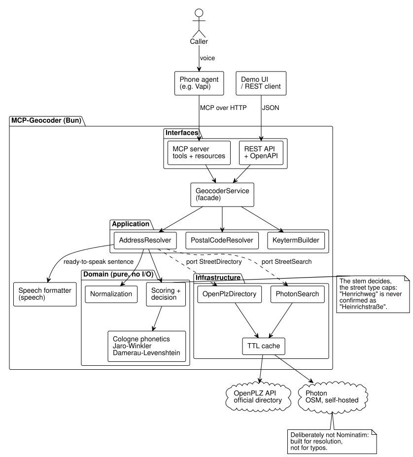
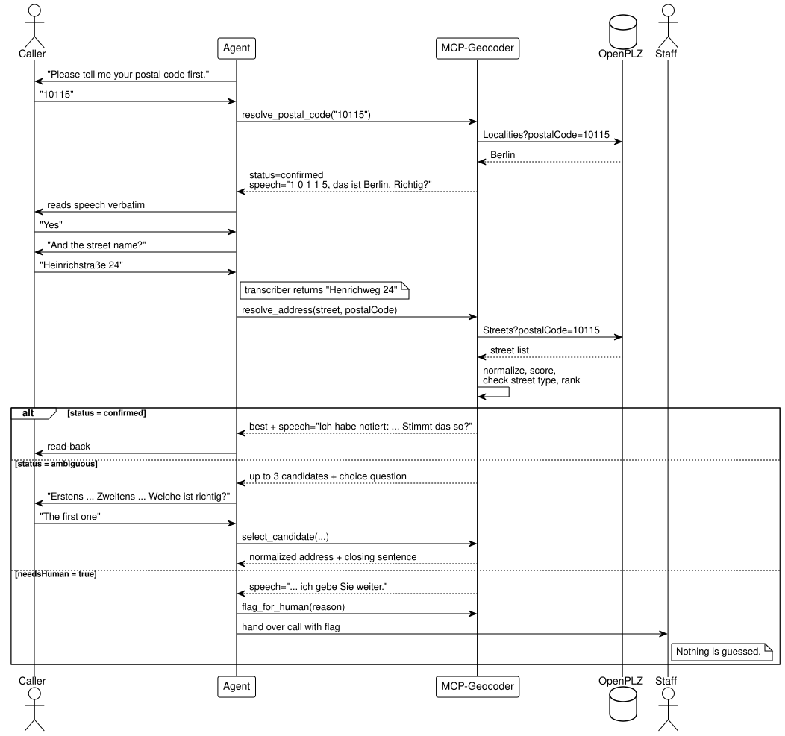
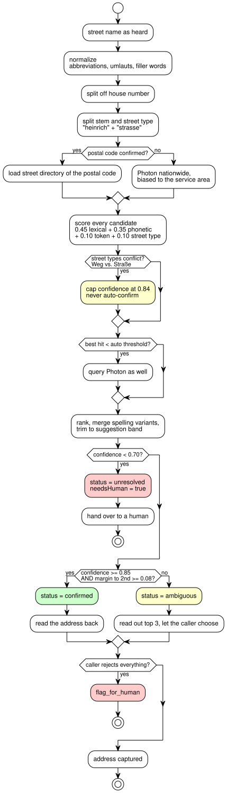

# MCP-Geocoder

Fault-tolerant German address capture for phone agents. Matches what the speech
recognizer *thought* it heard against the official street directory, returns confidence
instead of guesswork, and tells the agent what to say next — as an MCP server, a REST API,
and a demo web UI.

**Runtime:** Bun · **Package manager:** pnpm · **Lint:** Biome · **Container:** Docker · **Code:** English, **comments:** German

---

## Why

No speech recognition system understands German street names without errors. The
difference between a good and a bad phone agent is not whether it makes mistakes, but
whether it notices them.

An agent that silently accepts what it heard writes "Henrichweg 24" into the database
although the caller said "Heinrichstraße 24". The downstream lookup fails, and the end
customer does not experience "recognition is poor" but "the agent can't find my address".

This server turns that around: a hard failure becomes an ordinary follow-up question.

| Typical weakness | Where it is addressed here |
|---|---|
| Names, streets, places are misrecognized | Matching against the official directory of the postal code; Cologne phonetics + Jaro-Winkler; keyterm generator for the transcriber |
| Agent stumbles over numbers and abbreviations | Every response is TTS-ready (`speech`): postal codes digit by digit, abbreviations spelled out |
| Similar streets get mixed up | Conflicting street type (Weg ≠ Straße) caps confidence — never an automatic accept |
| Wrong data slips through silently | `needsHuman` flag: uncertain cases go to a person, nothing is guessed |

---

## Quick start

```bash
pnpm install
cp .env.example .env          # set service area and thresholds
pnpm check                    # typecheck + lint + test (offline, fixtures only)
pnpm serve                    # http://localhost:8080
```

No local Bun? Everything runs in Docker as well.

```bash
docker run --rm -p 8080:8080 ghcr.io/ai-workflow-automations/mcp-geocoder   # demo at http://localhost:8080
```

| URL | What |
|---|---|
| `/` | Demo UI: matching, hard cases, API docs |
| `/api/*` | REST API, see [API](#api) |
| `/openapi.json` | OpenAPI 3.1 — the single source of API documentation |
| `/mcp` | MCP Streamable HTTP — this is where the phone agent connects |
| `/health` | Data sources, thresholds, service area |

### Claude Code in 30 seconds

Prebuilt image on GHCR, nothing to clone or install besides Docker:

```bash
claude mcp add mcp-geocoder -- docker run -i --rm ghcr.io/ai-workflow-automations/mcp-geocoder stdio
```

Restrict to your service area with `-e SERVICE_AREA_POSTAL_CODES=10115,10117,10119` before the image name.
If `docker pull` answers `unauthorized`, the package is still private: log in with a token that has
`read:packages` (`echo $TOKEN | docker login ghcr.io -u <user> --password-stdin`), or make the package
public under the organization's package settings.

Or run it as a service once and connect over HTTP (also works for Vapi, n8n, etc.):

```bash
docker run -d --name geocoder -p 8080:8080 ghcr.io/ai-workflow-automations/mcp-geocoder
claude mcp add --transport http mcp-geocoder http://localhost:8080/mcp
```

With `MCP_AUTH_TOKEN` set, add `--header "Authorization: Bearer <token>"` to the second command.
Use `--scope user` to make the server available in every project.

Without Docker: clone, install, start Claude Code in the folder. [`.mcp.json`](.mcp.json)
registers the server for that project, no `claude mcp add` needed. Requires
[Bun](https://bun.sh) and pnpm on the machine — `.mcp.json` launches `bun run src/index.ts`.

```bash
curl -fsSL https://bun.sh/install | bash                  # once, if `which bun` is empty
git clone https://github.com/AI-Workflow-Automations/MCP-Geocoder && cd MCP-Geocoder && pnpm install
claude                                                    # asks once, then the server starts on demand
claude mcp add --scope user mcp-geocoder -- bun run "$PWD/src/index.ts"   # optional: every project
```

**`/mcp` shows `Failed to reconnect to mcp-geocoder: CONNECTION_CLOSED`?** The launch command exited
before speaking MCP. Run it by hand — the reason is in the first line of output:

```bash
bun run src/index.ts                                          # .mcp.json path: "command not found" → install Bun
docker run -i --rm ghcr.io/ai-workflow-automations/mcp-geocoder stdio   # Docker path: "unauthorized" → see above
```

A healthy start prints `[mcp-geocoder] stdio-Transport bereit` on stderr and then waits for input.

Claude Desktop (`claude_desktop_config.json`):

```json
{
  "mcpServers": {
    "mcp-geocoder": {
      "command": "docker",
      "args": ["run", "-i", "--rm", "ghcr.io/ai-workflow-automations/mcp-geocoder", "stdio"]
    }
  }
}
```

---

## Architecture



<details>
<summary>PlantUML source</summary>

Source file: [`docs/diagrams/01-architecture.puml`](docs/diagrams/01-architecture.puml)

</details>

Layered by dependency direction — the domain knows nothing about HTTP, MCP, or any data source:

```
src/
├── domain/            pure business logic, no I/O
│   ├── types.ts         MatchStatus, StreetCandidate, AddressResolution, ...
│   ├── ports.ts         StreetDirectory, StreetSearch, EscalationSink  (interfaces)
│   ├── normalization.ts abbreviations, umlauts, filler words, stem/street type
│   ├── phonetics.ts     Cologne phonetics (Kölner Phonetik)
│   ├── similarity.ts    Jaro-Winkler, Damerau-Levenshtein, token similarity
│   ├── scoring.ts       weights, street-type cap, ranking
│   └── decision.ts      confirmed / ambiguous / unresolved
├── application/       use cases, depend on ports only
│   ├── address-resolver.ts
│   ├── postal-code-resolver.ts
│   ├── keyterm-builder.ts
│   └── geocoder-service.ts   facade - the single entry point for MCP and REST
├── infrastructure/    adapters for the ports
│   ├── openplz-directory.ts  official directory
│   ├── photon-search.ts      fault-tolerant search (OSM)
│   ├── ttl-cache.ts, http-client.ts, escalation-log.ts
├── speech/            speech-formatter.ts - TTS-ready sentences, central phrases
├── mcp/               server.ts (tools + resources), api-guide.ts
├── api/               app.ts (Express: REST + MCP transport + demo), openapi.ts
├── config.ts          the only place that reads process.env
├── composition.ts     composition root - concrete implementations are wired here
├── index.ts           entry point stdio
└── serve.ts           entry point HTTP
```

**Why this way:** The hard-case tests run against a fixture directory instead of OpenPLZ —
possible because `AddressResolver` only knows the `StreetDirectory` port (dependency
inversion). MCP tools and REST routes call the same facade; there is no second code path
for the demo (DRY). The domain depends on nothing but itself.

---

## Conversation flow



<details>
<summary>PlantUML source</summary>

Source file: [`docs/diagrams/02-conversation.puml`](docs/diagrams/02-conversation.puml)

</details>

1. **Postal code first.** Digits survive narrowband telephony far better than place names,
   and a confirmed postal code shrinks the search space from hundreds of thousands of
   streets to a few hundred.
2. **Then the street** — against the directory of that postal code.
3. **React to `status`:** `confirmed` → read back · `ambiguous` → read out the choices ·
   `unresolved` → hand over.
4. **Never guess.** If the caller rejects everything: `flag_for_human`.

---

## Decision logic



<details>
<summary>PlantUML source</summary>

Source file: [`docs/diagrams/03-decision.puml`](docs/diagrams/03-decision.puml)

</details>

Absolute confidence alone is not enough. Three rules on top:

- **Margin to the runner-up.** Two almost equally good hits are never `confirmed`, even if
  both are above the threshold.
- **Street-type cap.** "Henrichweg" and "Heinrichstraße" share practically the same stem
  and the same sound. Weighted additively, that would clear the auto-accept threshold. But a
  different street type is a hard signal — in the directory these are two streets. Such a
  candidate is capped at 0.84 and at most read out as an option.
- **Suggestion band.** Only candidates close to the best one are read out. Three options
  of which two are obviously wrong tempt the caller to confirm anything.

---

## Hard cases

[`test/hard-cases.test.ts`](test/hard-cases.test.ts) is the acceptance criterion for the
matcher. Whoever changes weights or thresholds has to pass it. Excerpt:

| Heard | Why it is hard | Expected |
|---|---|---|
| `Henrichweg 24` | stem sounds like Heinrichstraße | `confirmed` Henrichweg, **never** Heinrichstraße |
| `Henrichstraße 24` | STT dropped the i | `confirmed` Heinrichstraße, **never** Henrichweg |
| `Heinrich 24` | street type missing, three candidates share the stem | `ambiguous` |
| `Bahnhofsplatz 2` | Bahnhofstraße has almost the same stem | `confirmed` Bahnhofsplatz |
| `Berliner` | Straße, Allee, Ring — undecidable | `ambiguous` |
| `Invaliden Str 12a` | detached, abbreviated street type, suffix | `confirmed` Invalidenstraße |
| `Akkerstraße 3` | kk instead of ck | `confirmed` Ackerstraße |
| `Ernst Reuter Platz` | hyphens missing | `confirmed` Ernst-Reuter-Platz |
| `Muehlenweg`, `Mülenweg` | umlaut as ue, missing h | `confirmed` Mühlenweg |
| `Am Wall` / `Neuer Wall` | Am Markt / Neuer Weg sound almost the same | `confirmed`, the right street |
| `ähm also die Torstraße` | filler words | `confirmed` Torstraße |
| `Zwitscherweg 7` | does not exist | `ambiguous` or `unresolved`, **never** `confirmed` |
| `Xylophonallee` | does not exist, sounds like nothing | `unresolved` |

The same cases are available in the demo UI under **Hard cases** — there against the real
directory of a postal code.

---

## API

REST and MCP are equivalent. Full description: `/openapi.json`, MCP tool `describe_api`,
MCP resource `geocoder://docs/api`.

| MCP tool | REST | When |
|---|---|---|
| `resolve_postal_code` | `POST /api/postal-code` | Always first |
| `resolve_address` | `POST /api/address` | For every street name |
| `select_candidate` | `POST /api/address/select` | After a choice question — only then the address counts as captured |
| `flag_for_human` | `POST /api/escalate` | Caller rejects everything, third failed attempt. Writes a structured log line |
| `generate_keyterms` | `POST /api/keyterms` | Once during setup: Deepgram keyterm list from the service area |
| `describe_api` | `GET /openapi.json` | This documentation, with the active thresholds |
| — | `GET /health` | Data sources, thresholds |

### Response format

```json
{
  "status": "ambiguous",
  "needsHuman": false,
  "candidates": [
    { "street": "Heinrichstraße", "postalCode": "10115", "locality": "Berlin", "confidence": 0.95, "source": "openplz",
      "breakdown": { "lexical": 0.96, "phonetic": 1, "token": 0.96, "streetType": 1, "total": 0.95 } },
    { "street": "Henrichweg", "postalCode": "10115", "locality": "Berlin", "confidence": 0.84, "source": "openplz",
      "breakdown": { "total": 0.84, "cappedBy": "Grundwort widerspricht sich (strasse vs. weg)" } }
  ],
  "speech": "Da habe ich mehrere Möglichkeiten. Erstens: Heinrichstraße in 1 0 1 1 5 Berlin. Zweitens: Henrichweg in 1 0 1 1 5 Berlin. Welche davon ist richtig?",
  "heard": { "postalCode": "10115", "street": "Heinrich 24", "houseNumber": "24" },
  "reason": "\"Heinrichstraße\" bei 0.95 - unter der Auto-Schwelle 0.85."
}
```

`speech` is read out **verbatim** — it is German, because the agent talks to German
callers. Postal codes and house numbers are already speakable, regardless of whether the
agent's TTS normalization works correctly. `reason` and `cappedBy` are German log text.

---

## Connecting to Vapi

Three steps, in this order:

1. Apply [`vapi/assistant-patch.json`](vapi/assistant-patch.json) block by block —
   transcriber to `nova-3`/`de`, barge-in threshold, German `formatPlan`. Does not need the server.
2. Create [`vapi/mcp-tool.json`](vapi/mcp-tool.json) as an MCP tool, URL pointing at your instance.
3. Add [`vapi/system-prompt-address.md`](vapi/system-prompt-address.md) to the system prompt.
   Without this block the agent will not call the tools in the right order.

Generate the keyterm list via `generate_keyterms` and paste it into step 1.

---

## Configuration

All values in [`.env.example`](.env.example). The important ones:

| Variable | Default | Effect |
|---|---|---|
| `SERVICE_AREA_POSTAL_CODES` | — | service area for Photon bias and keyterms |
| `CONFIDENCE_AUTO` | 0.85 | `confirmed` from here (given sufficient margin) |
| `CONFIDENCE_AMBIGUOUS` | 0.70 | choices from here, hand-over below |
| `MINIMUM_MARGIN` | 0.08 | minimum distance to the runner-up |
| `SUGGESTION_BAND` | 0.08 | suggestion band |
| `PHOTON_ENABLED` | true | `false` = official directory only |
| `MCP_AUTH_TOKEN` | — | bearer token for HTTP; `/health` stays open |
| `WEB_ENABLED` | true | `false` = only `/mcp` and `/health` |

**The thresholds are starting values, not validated numbers.** Procedure: run 30 real
calls, evaluate `reason` and `confidence` from the logs, adjust. The log lines from
`flag_for_human` (`event: "address_escalation"`) are the data basis. Suggested acceptance
metric: 95 % correctly captured addresses with 100 % read-back.

---

## Docker

```bash
docker compose pull && docker compose up  # prebuilt image from GHCR
docker compose up --build                 # build locally instead
docker compose --profile photon up        # plus a self-hosted Photon instance
```

Compose does not bind host ports — the services only `expose` 8080 (geocoder) and 2322
(Photon) inside the Compose network, meant for a reverse proxy or another stack on the same
network. For a host port, run the image directly (`docker run -p 8080:8080 …`) or add a
`ports:` entry in a `docker-compose.override.yml`.

### Image

`ghcr.io/ai-workflow-automations/mcp-geocoder`, built for `linux/amd64` and `linux/arm64`.

| Tag | Meaning |
|---|---|
| `latest`, `main` | current `main` after CI passed |
| `1.2.3`, `1.2`, `1` | release tags `v1.2.3` |
| `sha-<short>` | exact commit |

The entrypoint takes one argument: `serve` (default, HTTP on port 8080) or `stdio` (MCP over
stdin/stdout for Claude Code and Claude Desktop). Configuration is entirely via environment
variables, see [Configuration](#configuration).

The image builds in two stages: `node:22-alpine` resolves dependencies with pnpm
(`node-linker=hoisted`, so `node_modules` is flat), `oven/bun:1-alpine` runs it. No build
step — Bun runs TypeScript directly. Runs as user `bun`, health check on `/health`.

The public Photon instance does not carry telephony load. For production enable the
`photon` profile — the first start downloads the Germany extract (several GB) — and set
`PHOTON_BASE_URL=http://photon:2322`.

---

## Quality gates

```bash
pnpm check        # typecheck + lint + test, in that order
```

| Step | Tool | What it catches |
|---|---|---|
| `pnpm typecheck` | tsc | type errors |
| `pnpm lint` | [Biome](https://biomejs.dev) — [`biome.json`](biome.json) | unused code, `any`, cognitive complexity > 15, non-null assertions, a11y in the web UI, formatting |
| `pnpm test` | bun test | behaviour, including the hard cases |

`pnpm lint:fix` applies Biome's safe fixes.

### CI

[`.github/workflows/ci.yml`](.github/workflows/ci.yml) runs the three gates above (pnpm + Bun),
then a Docker build with a smoke test against `/health`. Runs on push to `main`, on release tags
`v*`, on every pull request, and manually. On push (not on pull requests) the `publish` job then
pushes the multi-arch image to GHCR — see [Image](#image) for the tag scheme.

---

## Diagrams

SVGs in [`docs/diagrams/`](docs/diagrams/), sources next to them as `.puml`. After changes:

```bash
./docs/diagrams/render.sh     # requires: brew install plantuml graphviz
```

Without Graphviz the script falls back to `smetana`. The committed SVGs were rendered with
PlantUML 1.2024.8.

---

## Limitations

- **No threshold reliably separates a non-existent street from a badly transcribed one.**
  Hence the exit via `flag_for_human`, not ever-stricter thresholds.
- **Keyterm prompting for German is unresolved.** The Vapi docs say for Deepgram "keywords
  work with English models"; Deepgram advertises keyterm prompting for all supported
  languages including German. Test before rollout.
- **Narrowband stays narrowband.** The frequencies that distinguish similar-sounding names
  are gone on the phone. The consequence is dialogue design, not model choice: force short
  answers, postal code instead of place name, spell surnames, always read back.
- **Streets without a street type** ("Am Markt", "Bernauer") are harder to cap — there only
  the margin to the runner-up applies.

---

*Data sources: [OpenPLZ API](https://www.openplzapi.org/) · [Photon (komoot)](https://github.com/komoot/photon) ·
[Deepgram Keyterm Prompting](https://developers.deepgram.com/docs/keyterm) · [Vapi MCP](https://docs.vapi.ai/tools/mcp)*
